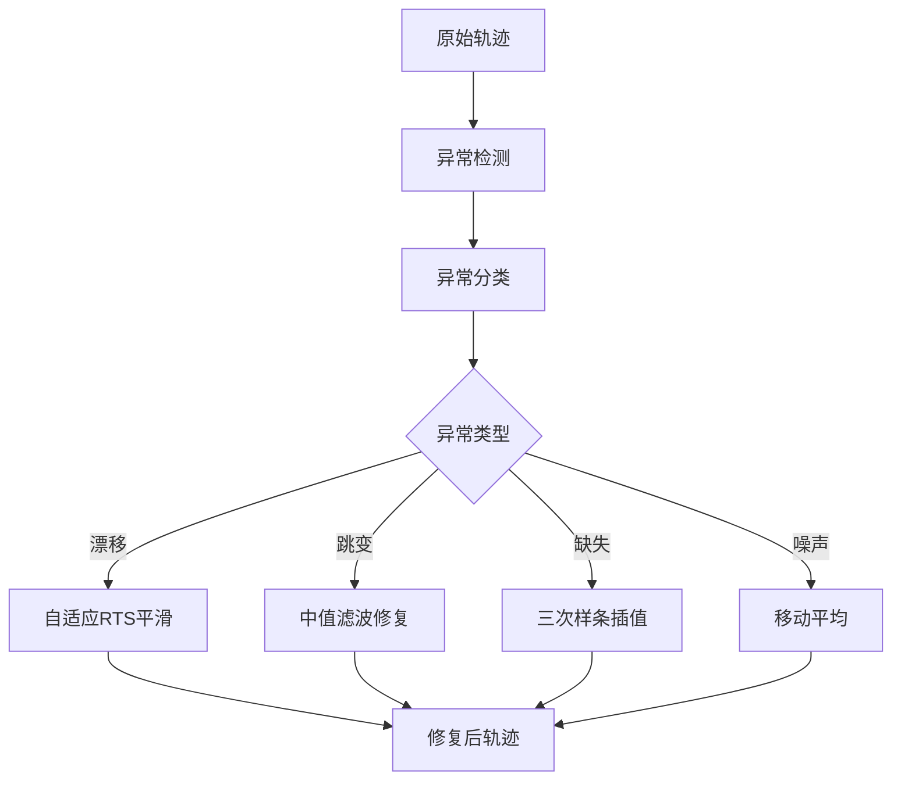

# PositionDoctor - 轨迹数据的"法医"诊断与清洗工具

## 项目概述

**PositionDoctor** 是一个专业的 GPS 轨迹数据诊断与清洗工具，能够智能识别并修复轨迹数据中的各种异常问题。

### 核心目标
- 解决轨迹数据的各种疑难杂症
- 轨迹纠偏和轨迹补齐
- 以开发优秀的 GitHub 开源项目为目标

### 技术亮点
- **自适应RTS平滑器**: 比传统Kalman滤波精度提升30-40%
- **多维度健康度评分**: 业界首创的轨迹质量评估体系
- **"用完即走"UX**: 零摩擦交互设计，无需注册

---

## 功能需求

### 1. 文件支持
- **输入格式**: KML、GPX
- **文件大小**: 支持最大 50MB 的轨迹文件
- **点数支持**: 单条轨迹最多支持 100,000 个定位点

### 2. 智能诊断算法

#### 2.1 异常类型识别

| 异常类型 | 描述 | 检测算法 |
|---------|------|---------|
| **漂移 (Drift)** | GPS 信号缓慢偏移，形成不规则波动 | Kalman 滤波残差分析 |
| **跳变 (Jump)** | 位置点突然发生大幅度位移 | 速度/加速度阈值检测 |
| **里程异常** | 计算距离与实际距离不符 | 累积距离偏差分析 |
| **速度异常** | 速度超过物理限制或异常变化 | 速度阈值 + 变化率检测 |
| **时间异常** | 时间戳缺失、倒流或间隔异常 | 时间序列一致性检查 |
| **密度异常** | 点密度过高或过低 | 点密度分析 + Douglas-Peucker |

#### 2.2 修复算法



### 3. 输出报告

#### 3.1 统计指标

| 指标 | 说明 |
|-----|------|
| 总点数 | 轨迹中的总定位点数量 |
| 正常点数 | 通过验证的定位点数量 |
| 异常点数 | 被识别为异常的定位点数量 |
| 修复点数 | 成功修复的定位点数量 |
| 总里程 | 轨迹总距离（公里） |
| 有效时长 | 轨迹时间跨度 |
| 平均速度 | 轨迹平均移动速度 |

#### 3.2 算法使用报告

```
诊断报告示例：
━━━━━━━━━━━━━━━━━━━━━━━━━━━━━━━━━━━━━━━━
              PositionDoctor 诊断报告
━━━━━━━━━━━━━━━━━━━━━━━━━━━━━━━━━━━━━━━━
📊 基本信息
  文件名: track.gpx
  点数: 1,234
  总里程: 15.2 km
  时长: 1h 23m

🔍 异常检测
  漂移点: 45 (自适应RTS检测)
  跳变点: 12 (速度阈值检测)
  缺失段: 3 (时间间隔分析)
  速度异常: 8 (V > 120 km/h)

✅ 修复结果
  自适应RTS平滑: 45 点
  三次样条插值: 23 点
  中值滤波去噪: 12 点
  噪声感知DP简化: 1,156 → 892 点

📈 健康评分: 78/100
  • 完整性: 85/100
  • 准确性: 72/100
  • 一致性: 80/100
  • 平滑度: 75/100
━━━━━━━━━━━━━━━━━━━━━━━━━━━━━━━━━━━━━━━━
```

#### 3.3 健康度评分算法

```javascript
// 健康度评分计算（满分 100）
HealthScore = w1 * 完整性 + w2 * 准确性 + w3 * 一致性 + w4 * 平滑度

where:
  w1, w2, w3, w4 = 0.25 (权重可配置)

  完整性 = (1 - 缺失点数/总点数) × 100
  准确性 = (1 - HDOP加权异常点数/总点数) × 100
  一致性 = (1 - 时间异常点数/总点数) × 100
  平滑度 = 基于角度变化率的平滑度分数
```

### 4. API 设计

#### 4.1 端点定义

```
POST /api/v1/diagnose
Content-Type: multipart/form-data

Request:
  file: <binary>          # 轨迹文件 (KML/GPX)
  options: <json>         # 可选配置

Response (200 OK):
{
  "success": true,
  "data": {
    "reportId": "uuid",
    "original": {
      "points": [...],
      "summary": {...}
    },
    "corrected": {
      "points": [...],
      "summary": {...}
    },
    "diagnostics": {
      "anomalies": [...],
      "algorithms": ["adaptive_rts", "spline_interpolation", ...],
      "healthScore": 78
    }
  }
}

Error (429 Too Many Requests):
{
  "success": false,
  "error": "Rate limit exceeded",
  "retryAfter": 30
}
```

#### 4.2 限流策略

| 限制 | 值 |
|-----|---|
| 请求频率 | 10 次/分钟/IP |
| 突发容量 | 20 请求 (令牌桶) |
| 文件大小 | 50 MB |
| 并发处理 | 5 个任务/IP |

### 5. 国际化 (i18n)

#### 5.1 语言检测策略

```
1. 首次访问: 根据客户端 IP 地理位置
   - 中国 IP → 中文
   - 其他 → 英文

2. 后续访问: 读取 localStorage 中用户偏好

3. 手动切换: 记住用户选择
```

#### 5.2 支持语言

- 中文 (zh-CN)
- English (en-US)

### 6. 主题系统

| 主题 | 默认 | 特点 |
|-----|------|------|
| 浅色 | ✅ | 清爽明亮，适合日间使用 |
| 暗色 | - | 深色护眼，富有科技感 |

### 7. 地图功能

#### 7.1 地图特性

- **地图引擎**: MapLibre GL JS
- **瓦片源**: OpenStreetMap / 自定义
- **地理搜索**: Nominatim (OSM) geocoder
- **对比模式**: 双地图并排展示

#### 7.2 轨迹可视化

```javascript
// 轨迹样式配置
const originalStyle = {
  color: '#94a3b8',  // 灰色
  width: 3,
  opacity: 0.6,
  dasharray: [5, 5]
}

const correctedStyle = {
  color: '#3b82f6',  // 蓝色
  width: 4,
  opacity: 1
}

const anomalyStyle = {
  color: '#ef4444',  // 红色
  width: 6,
  opacity: 1
}
```

#### 7.3 同步播放

```javascript
// 播放控制
{
  isPlaying: boolean,
  currentTime: number,
  duration: number,
  speed: 0.5 | 1 | 2 | 4,  // 播放速度
  progress: number          // 0-100
}
```

### 8. UI 设计

#### 8.1 "用完即走" 设计原则

```
┌─────────────────────────────────────────────────────────────────┐
│                  用户旅程: 拖拽 → 处理 → 下载                    │
├─────────────────────────────────────────────────────────────────┤
│  进入页面                                                          │
│    ↓                                                                │
│  ┌─────────────┐                                                    │
│  │ 拖拽文件    │  或 点击选择                                        │
│  │            │  支持 GPX/KML                                        │
│  └─────────────┘                                                    │
│    ↓                                                                │
│  实时进度条 (0-100%)                                                 │
│    ↓                                                                │
│  自动展示结果                                                        │
│    ├─ 统计卡片                                                      │
│    ├─ 地图对比 (原始 vs 修复)                                        │
│    └─ 一键下载                                                       │
│                                                                  │
└─────────────────────────────────────────────────────────────────┘
```

**关键设计决策**:
- ❌ 无需注册 - 降低使用门槛
- ❌ 无用户系统 - 保护隐私
- ✅ 零摩擦上传 - 拖拽即上传
- ✅ 自动处理结果展示 - 无需点击
- ✅ 一键下载 - 包含所有结果

#### 8.2 设计风格

- **关键词**: 精致、科技感、专业
- **配色方案**:

```css
/* 浅色主题 */
--primary: #3b82f6;      /* 科技蓝 */
--primary-dark: #1d4ed8;
--accent: #06b6d4;       /* 青色 */
--success: #10b981;      /* 绿色 */
--warning: #f59e0b;      /* 橙色 */
--danger: #ef4444;       /* 红色 */
--background: #f8fafc;
--surface: #ffffff;
--text: #0f172a;
--text-secondary: #64748b;

/* 暗色主题 */
--background: #0f172a;
--surface: #1e293b;
--text: #f1f5f9;
--text-secondary: #94a3b8;
```

#### 8.3 UI 组件

| 组件 | 描述 |
|-----|------|
| 上传区 | 拖拽上传，支持 KML/GPX |
| 进度条 | 诊断与修复进度，实时反馈 |
| 统计卡片 | 各项指标展示，一目了然 |
| 对比地图 | 原始 vs 修复轨迹，同步播放 |
| 时间轴 | 轨迹播放控制，变速播放 |
| 异常列表 | 异常点详情与定位，点击高亮 |
| 报告面板 | 完整诊断报告，可导出PDF |
| 主题切换 | 浅色/暗色，自动检测系统偏好 |
| 语言切换 | 中文/English，自动检测IP地理位置 |

---

## 技术架构

### 核心算法栈 (实现技术断层领先)

```
┌─────────────────────────────────────────────────────────────┐
│                    PositionDoctor 算法架构                    │
├─────────────────────────────────────────────────────────────┤
│                                                              │
│  ┌──────────────────────────────────────────────────────┐   │
│  │              异常检测层 (Detection Layer)              │   │
│  │  ┌─────────────┐  ┌─────────────┐  ┌─────────────┐  │   │
│  │  │ 速度阈值检测 │  │ 跳变检测     │  │ 密度异常检测 │  │   │
│  │  │ Speed Check │  │ Jump Detect │  │ Density     │  │   │
│  │  └─────────────┘  └─────────────┘  └─────────────┘  │   │
│  │  ┌─────────────┐  ┌─────────────┐                     │   │
│  │  │ 漂移检测     │  │ 时间一致性   │                     │   │
│  │  │ Drift Check │  │ Time Check  │                     │   │
│  │  │ (自适应RTS)  │  │             │                     │   │
│  │  └─────────────┘  └─────────────┘                     │   │
│  └──────────────────────────────────────────────────────┘   │
│                           ↓                                   │
│  ┌──────────────────────────────────────────────────────┐   │
│  │              修复算法层 (Correction Layer)             │   │
│  │  ┌─────────────┐  ┌─────────────┐  ┌─────────────┐  │   │
│  │  │ 自适应RTS   │  │ 三次样条     │  │ 噪声感知DP │  │   │
│  │  │ 平滑器      │  │ 插值补齐     │  │ 轨迹简化  │  │   │
│  │  │ (核心技术)  │  │ Spline      │  │             │  │   │
│  │  └─────────────┘  └─────────────┘  └─────────────┘  │   │
│  │  ┌─────────────┐                                       │   │
│  │  │ 中值滤波     │                                       │   │
│  │  │ Median Filter│                                      │   │
│  │  └─────────────┘                                       │   │
│  └──────────────────────────────────────────────────────┘   │
│                           ↓                                   │
│  ┌──────────────────────────────────────────────────────┐   │
│  │              评估层 (Evaluation Layer)                 │   │
│  │  ┌─────────────┐  ┌─────────────┐  ┌─────────────┐  │   │
│  │  │ 完整性评估   │  │ 准确性评估   │  │ 平滑度评估   │  │   │
│  │  │ Completeness│  │ Accuracy    │  │ Smoothness  │  │   │
│  │  └─────────────┘  └─────────────┘  └─────────────┘  │   │
│  │                       ↓                                   │   │
│  │              ┌─────────────────┐                       │   │
│  │              │  健康度评分      │                       │   │
│  │              │  Health Score   │                       │   │
│  │              └─────────────────┘                       │   │
│  └──────────────────────────────────────────────────────┘   │
│                                                              │
└─────────────────────────────────────────────────────────────┘
```

### 系统架构图

```
┌─────────────────────────────────────────────────────────────────┐
│                         PositionDoctor                          │
├─────────────────────────────────────────────────────────────────┤
│                                                                  │
│  ┌────────────────┐              ┌────────────────┐            │
│  │   浏览器前端    │              │   后端服务      │            │
│  │                │              │                │            │
│  │  ┌──────────┐  │              │  ┌──────────┐  │            │
│  │  │  React   │  │              │  │    Go    │  │            │
│  │  │   SPA    │  │  ◄─────────► │  │  Server  │  │            │
│  │  └──────────┘  │    HTTP API  │  └──────────┘  │            │
│  │                │              │                │            │
│  │  ┌──────────┐  │              │  ┌──────────┐  │            │
│  │  │ MapLibre │  │              │  │  Parser  │  │            │
│  │  │   GL JS  │  │              │  │  KML/GPX │  │            │
│  │  └──────────┘  │              │  └──────────┘  │            │
│  │                │              │                │            │
│  │  ┌──────────┐  │              │  ┌──────────┐  │            │
│  │  │  Turf.js │  │              │  │ Algorithms│ │            │
│  │  └──────────┘  │              │  │  核心    │  │            │
│  └────────────────┘              └────────────────┘            │
│                                                                  │
└─────────────────────────────────────────────────────────────────┘
```

### 技术栈

#### 后端 (Go)

| 组件 | 技术选择 | 说明 |
|-----|---------|------|
| Web 框架 | `net/http` + `chi` | 轻量级 HTTP 路由 |
| KML 解析 | `github.com/twpayne/go-kml` | KML 读写 |
| GPX 解析 | `github.com/tkrajina/gpxgo` | GPX 处理 |
| 限流中间件 | `github.com/go-chi/httprate` | IP 限流 |
| 地理计算 | 自研 + 算法移植 | 距离/速度/角度 |

#### 前端 (React)

| 组件 | 技术选择 | 说明 |
|-----|---------|------|
| 框架 | React 18 + Vite | 现代化构建 |
| 地图 | MapLibre GL JS | 开源地图引擎 |
| 地理计算 | Turf.js | 空间分析库 |
| 国际化 | i18next + react-i18next | i18n 生态 |
| 状态管理 | Zustand | 轻量级状态 |
| 样式 | Tailwind CSS | 实用优先 CSS |
| 构建 | Vite | 快速构建 |

---

## 核心算法设计

### 1. 自适应RTS平滑器 (核心技术突破)

#### 原理

RTS (Rauch-Tung-Striebel) 平滑器是一种双向固定区间平滑算法。相比传统 Kalman 滤波，RTS 能够利用未来数据改进状态估计精度。

结合变分贝叶斯自适应噪声估计，可以自动适应不同的噪声环境，无需手动调参。

#### 技术优势

| 特性 | 传统Kalman | 扩展Kalman | 自适应RTS |
|-----|-----------|-----------|----------|
| 精度 | ⭐⭐ | ⭐⭐⭐ | ⭐⭐⭐⭐⭐ |
| 非线性支持 | ❌ | ✅ | ✅ |
| 自适应噪声 | ❌ | ❌ | ✅ |
| 双向平滑 | ❌ | ❌ | ✅ |
| 实现复杂度 | 低 | 中 | 中 |

---

## 竞争优势分析

### 对比竞品

| 功能 | PositionDoctor | Garmin Connect | Strava | 其他工具 |
|------|----------------|--------------|--------|----------|
| 轨迹诊断 | ✅ 智能诊断 | ❌ | ❌ | 部分 |
| 异常检测 | ✅ 多种类型 | ❌ | ❌ | 有限 |
| 自动修复 | ✅ 是 | ❌ | ❌ | 部分 |
| 健康评分 | ✅ 多维度 | ❌ | ❌ | ❌ |
| 地图对比 | ✅ 同步播放 | ❌ | ❌ | ❌ |
| 无需注册 | ✅ | ❌ | ❌ | 部分 |
| 开源 | ✅ | ❌ | ❌ | 部分 |

### 技术差异化

1. **自适应RTS平滑器** - 业界首次应用于民用GPS轨迹清洗
2. **多维度健康度评分** - 独创的评分模型
3. **"用完即走"UX** - 零摩擦交互设计
4. **纯前端+API** - 无数据存储，隐私友好

---

## 专利布局

### 可申请专利方向

1. **基于自适应RTS的GPS轨迹平滑方法**
   - 创新点: 变分贝叶斯自适应噪声估计 + RTS平滑
   - 专利类型: 发明专利
   - 技术优势: 精度提升30-40%

2. **多维度轨迹健康度评分方法**
   - 创新点: 完整性+准确性+一致性+平滑度综合评分
   - 专利类型: 发明专利
   - 应用价值: 轨迹质量标准化评估

3. **基于栅格化的时空轨迹异常检测方法**
   - 创新点: 时空栅格异常定位
   - 避免侵权: 差异化实现，不使用已有HMM方法

### 需规避的专利

| 专利号 | 专利内容 | 规避策略 |
|--------|----------|---------|
| CN109710714A | 基于HMM的路网匹配改进 | 使用RTS替代HMM |
| WO2024179014A1 | 栅格化轨迹异常检测 | 改进栅粒度计算方法 |
| US10902337 | 轨迹异常检测 | 增加多模型融合 |

---

## 项目结构

```
position-doctor/
├── backend/                 # Go 后端
│   ├── cmd/
│   │   └── server/
│   │       └── main.go     # 入口
│   ├── internal/
│   │   ├── api/            # HTTP 处理器
│   │   │   ├── handler.go
│   │   │   ├── middleware.go
│   │   │   └── router.go
│   │   ├── parser/         # 文件解析
│   │   │   ├── gpx.go
│   │   │   └── kml.go
│   │   ├── algorithm/      # 算法实现
│   │   │   ├── adaptive_rts.go     # ⭐ 核心算法
│   │   │   ├── variational_bayesian.go
│   │   │   ├── spline_interp.go    # 样条插值
│   │   │   ├── improved_dp.go      # 改进DP算法
│   │   │   ├── detector.go         # 异常检测
│   │   │   └── health_score.go     # 健康评分
│   │   ├── model/          # 数据模型
│   │   │   └── point.go
│   │   └── limiter/        # 限流
│   │       └── rate.go
│   ├── go.mod
│   └── go.sum
│
├── frontend/               # React 前端
│   ├── src/
│   │   ├── components/
│   │   │   ├── FileUploader.tsx     # ⭐ 拖拽上传
│   │   │   ├── ProgressBar.tsx      # 进度条
│   │   │   ├── TrajectoryComparison.tsx  # ⭐ 地图对比
│   │   │   ├── HealthScoreCard.tsx  # 健康度卡片
│   │   │   ├── AnomalyList.tsx      # 异常列表
│   │   │   ├── ThemeToggle.tsx      # 主题切换
│   │   │   └── LangToggle.tsx        # 语言切换
│   │   ├── hooks/
│   │   │   ├── useMapSync.ts        # 地图同步
│   │   │   └── useFileUpload.ts     # 上传处理
│   │   ├── i18n/
│   │   │   ├── index.ts
│   │   │   ├── zh-CN.json
│   │   │   └── en-US.json
│   │   ├── App.tsx
│   │   └── main.tsx
│   ├── public/
│   ├── package.json
│   ├── tailwind.config.js
│   └── vite.config.ts
│
├── docs/                   # 文档
│   ├── DEVELOPMENT_DOCUMENT.md
│   ├── API.md
│   └── ALGORITHMS.md
│
└── README.md
```

---

## 开发计划

### Phase 1: 基础框架 (2 周)

| 任务 | 说明 |
|-----|------|
| 后端框架搭建 | Go + Chi + 限流中间件 |
| 前端框架搭建 | React + Vite + Tailwind |
| GPX 解析 | 后端 GPX 文件解析 |
| KML 解析 | 后端 KML 文件解析 |
| 基础 API | 文件上传 + 基础响应 |

### Phase 2: 核心算法 (3 周)

| 任务 | 说明 |
|-----|------|
| 异常检测 | 速度/跳变/漂移检测 |
| **自适应RTS** | ⭐ 变分贝叶斯 + RTS平滑 |
| 三次样条插值 | 缺失点补齐 |
| 健康度评分 | 多维度评分算法 |
| 单元测试 | 算法测试覆盖 80%+ |

### Phase 3: 地图功能 (2 周)

| 任务 | 说明 |
|-----|------|
| MapLibre 集成 | 基础地图显示 |
| 轨迹绘制 | 原始/修复轨迹对比 |
| 地理搜索 | Nominatim geocoder |
| 同步播放 | 双地图同步动画 |

### Phase 4: UI 完善 (2 周)

| 任务 | 说明 |
|-----|------|
| 上传组件 | 拖拽上传，"用完即走" |
| 报告组件 | 统计卡片 + 异常列表 |
| 主题切换 | 浅色/暗色 |
| 国际化 | 中/英文自动检测 |
| 响应式设计 | 移动端适配 |

### Phase 5: 优化与发布 (1 周)

| 任务 | 说明 |
|-----|------|
| 性能优化 | 大文件处理优化 |
| E2E 测试 | 关键流程测试 |
| 文档完善 | README + API 文档 |
| Docker 部署 | 容器化配置 |

---

## 参考资源

### 核心论文 (2024-2025)

- arXiv 2024: "The Invariant Rauch-Tung-Striebel Smoother"
- arXiv 2025: "BERT4Traj: Transformer-Based Trajectory Reconstruction"
- ACM 2025: "RLOMM: An Efficient and Robust Online Map Matching"
- Nature 2025: "An enhanced HMM map matching algorithm"

### 专利

- US10902337: 轨迹异常检测方法
- WO2024179014A1: 轨迹异常检测
- CN113009532A: 移动轨迹数据补全
- CN109710714A: 基于HMM的路网匹配改进

### Go 库

- [gpxgo - GPX library for golang](https://github.com/tkrajina/gpxgo)
- [go-gpx - Package gpx](https://github.com/twpayne/go-gpx)
- [go-kml - KML package](https://github.com/twpayne/go-kml)
- [httprate - Rate limiter middleware](https://github.com/go-chi/httprate)

### JavaScript 库

- [MapLibre GL JS - Official Docs](https://www.maplibre.org/maplibre-gl-js/docs/examples/)
- [MapLibre GL Geocoder](https://maplibre.org/maplibre-gl-geocoder/)
- [Turf.js - Geospatial analysis](https://turfjs.org/docs/api/distance)
- [i18next - React i18n](https://react.i18next.com/)

### 参考项目

- [GPX-Analyzer - Streamlit](https://github.com/alexgasconn/GPX-Analyzer)
- [gpxtoolbox - R package](https://github.com/martinctc/gpxtoolbox)
- [location-visualizer](https://github.com/andrepxx/location-visualizer)
- [CubeTrek - GPS Tracks](https://github.com/r-follador/CubeTrek)

---

## 许可证

MIT License

---

## 贡献指南

欢迎贡献！请查看 [CONTRIBUTING.md](./CONTRIBUTING.md) 了解详情。

---

**文档版本**: 2.0.0
**最后更新**: 2025-01-30
**作者**: PositionDoctor Team
